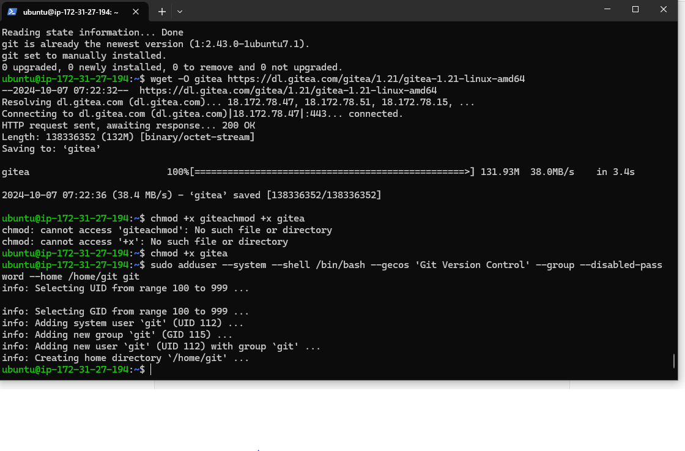

# Jenkins
1) Create two  ubuntu instances, one for jenkins and another for Gitea.
   
   make sure you add these ports for  launching jenkins (port 8080 must for jenkins)
    


add below ports for Gitea instance (port 3000 must for gitea)


2)connect the gitea instance.
On gitea instance execute the folllowing steps.


where 16 is the version here , edit it to the version that you have installed.


exit the postgresql DB with \q


Add the following line as the first line of pg_hba.conf . It allows access to all databases for all users with an encrypted password:

# TYPE DATABASE USER CIDR-ADDRESS  METHOD
host  all  all 0.0.0.0/0 scram-sha-256

to allow the connection from outside pgAdmin , Add or edit the following line in your postgresql.conf :

```
listen_addresses = '*'
```

Restart the service

service postgresql restart (try to use nano editor rather than vim editor ) and comment off the listen address .


-> in nano editor ctr+O --> ctrl+C -->ctrl+X----> save modified buffer yes +enter 

2)steps to install Gitea :-----

Installing Gitea--->
Step 1 — Update the APT package cache, upgrade the already installed software and install Git:

```
sudo apt update && sudo apt upgrade -y && sudo apt install git -y
```

Step 2 — Download the Gitea Binary and make it executable:

```
wget -O gitea https://dl.gitea.com/gitea/1.21/gitea-1.21-linux-amd64
chmod +x gitea
```
Step 3 — Add the user that will run the Gitea application:

```
sudo adduser --system --shell /bin/bash --gecos 'Git Version Control' --group --disabled-password --home /home/git git
```

  


Step 4 — Create the folder structure that is used by Gitea to store data:

```
sudo mkdir -p /var/lib/gitea/custom
sudo mkdir -p /var/lib/gitea/data
sudo mkdir -p /var/lib/gitea/log
sudo chown -R git:git /var/lib/gitea/
sudo chmod -R 750 /var/lib/gitea/
sudo mkdir /etc/gitea
sudo chown root:git /etc/gitea
sudo chmod 770 /etc/gitea
```

Step 5 — Set the working directory of Gitea:

```
export GITEA_WORK_DIR=/var/lib/gitea/
```

Step 6 — Copy the Gitea binary file to /usr/local/bin to make it available system-wide:

```
sudo cp gitea /usr/local/bin/gitea
```

Run Gitea as service
Step 1 — Create a systemd service for Gitea

```
sudo vim /etc/systemd/system/gitea.service
```

Step 2 — Copy the following content into the service file:

```
[Unit]
    Description=Gitea (Git with a cup of tea)
       After=syslog.target 
        After=network.target

[Service]

    RestartSec=2s
    Type=simple
    User=git
    Group=git
     WorkingDirectory=/var/lib/gitea/
    ExecStart=/usr/local/bin/gitea web -c /etc/gitea/app.ini
     Restart=always
     Environment=USER=git HOME=/home/git GITEA_WORK_DIR=/var/lib/gitea

[Install]
     WantedBy=multi-user.target
```
Step 3 — Enable the service and start Gitea at system boot:


```
sudo systemctl enable gitea.service
sudo systemctl start gitea.service
```

Step 4 — In a web browser go to http://your_instance_ip:3000 to access the Gitea application


click on install gitea


password for gitea --> gitea.


register for gitea


3)connect the instance of jenkins and install jenkins in it with java dependency.


4) go to dashboard ----> manage jenkins
  manage plugins---> available plugins -->intsall gitea .


5) create an repo  in gitea . enter in that repo then go to the settings ----> add webhooks.--> select Gitea.
   


6)add the target URL as --->
```
http://65.1.168.38:8080/gitea-webhook/post 
```

(<the ip of  jenkins instance>:8080/gitea-webhook/post

HTTP method --->POST .
POST CONTENT TYPE --->application/json.

then ,you make click on test delivery to check whether webhooks has been created or not.


7)inside the gitea repo create or upload new file 
  add the following script in it 

```
  pipeline {
    agent any
    stages {
        stage('Build') {
            steps {
                echo 'Building  the jenkinsfile.'
                // Add your build commands here
            }
        }
        stage('Test') {
            steps {
                echo 'Testing...'
                // Add your test commands here
            }
        }
        stage('Deploy') {
            steps {
                echo 'Deploying...'
                // Add your deployment commands here
            }
        }
    }
}
```

8)


then save the changes


8)go to the jenkins dashboard click on build now .


